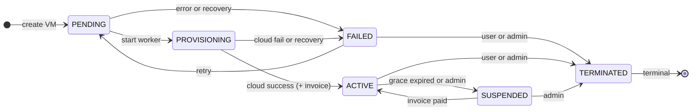

# Architecture

Deployment topology, request flow, and data model for PICO Cloud.

Hub: [DESIGN.md](DESIGN.md) · Tradeoffs: [DECISIONS.md](DECISIONS.md) · Run the app: [DEMO.md](DEMO.md)

---

## Deployment topology

```
docker-compose.yml
├── db   postgres:16-alpine  (host port 5433, internal 5432)
└── web  node:22-alpine      (port 3080, public)
     ├── Next.js App Router
     │    ├── /app/(pages)    — server + client components
     │    └── /app/api/       — Route Handlers
     └── lib/                 — domain logic, isolated from HTTP
          ├── cloud/          — CloudProvider interface + mock
          ├── provisioning/   — FSM + orchestrator
          ├── pricing/        — pure estimator function
          ├── audit/          — append-only event logger
          └── auth/           — session helpers
```

One web container, one DB. No worker, Redis, or queue — see [DECISIONS.md](DECISIONS.md) (section **In-process async**).

Main ideas:

- Mock cloud sits behind a `CloudProvider` interface (swap for real OpenStack later)
- Same pricing function on client (sliders) and server (provision) — server always recalculates at create time
- Admin routes checked on the server; wrong-user VM access returns 404

---

## Request flow (provision a VM)

```
Browser
  → POST /api/resources
    → validate session (iron-session cookie)
    → validate body (Zod)
    → check duplicate name (userId + name unique)
    → calculate price (UnitPrice table or Package row)
    → INSERT Resource (status = PENDING)
    → logEvent(RESOURCE_PROVISION_REQUESTED)
    → runProvisionAsync(resourceId)   ← fire and forget
    → 201 { id }

Browser → /resources/:id
  → polls GET /api/resources/:id every 1.5s while PENDING or PROVISIONING

Background (same process):
  → PENDING → PROVISIONING
  → CloudProviderMock.provision() (~6–8s, progress callbacks)
  → PROVISIONING → ACTIVE (+ invoice UNPAID)
  OR
  → PROVISIONING → FAILED
```

---

## Data model

```
User ──────────────────────────────────────────┐
  id, email, passwordHash, displayName, role   │
                                               │
Package                                        │
  id, slug, name, vcpu, ramGb, storageGb,      │
  monthlyPriceBdt                              │
                                               │
UnitPrice                                      │
  dimension (vcpu|ram_gb|storage_gb), price      │
                                               │
Resource ─── User (userId)                     │
           ─── Package? (packageId, nullable)  │
  name, specs, regionCode, status, publicIp      │
  monthlyPriceBdt  ← stored at provision time    │
                                               │
Invoice ─── Resource (1:1)                     │
  amountBdt, status (UNPAID|PAID)              │
                                               │
AuditEvent ─── User? (userId)                  │
  entityType, entityId, action, detail         │
  (polymorphic — no FK on entityId)            │
                                               │
UsageRecord ─── Resource                       │
  hourly buckets (demo metering)                 │
└──────────────────────────────────────────────┘
```

Notes:

- `Resource.packageId` is null for custom VMs
- `monthlyPriceBdt` is denormalized at create so fixed and custom paths share invoice logic
- `AuditEvent.entityId` is a plain string (polymorphic — Prisma has no polymorphic FK)
- Status and role use Prisma enums (`ResourceStatus`, `InvoiceStatus`, `UserRole`, etc.) — DB rejects invalid values; FSM in code enforces valid transitions via `transitionResourceStatus()` — see [DECISIONS.md](DECISIONS.md) (section **FSM as a data table**)

## VM lifecycle (FSM)



6 states (PENDING, PROVISIONING, ACTIVE, FAILED, SUSPENDED, TERMINATED). Rules live in `lib/provisioning/fsm.ts`; all status writes go through `transitionResourceStatus()` so illegal moves throw before persistence.

Full schema: `prisma/schema.prisma`
